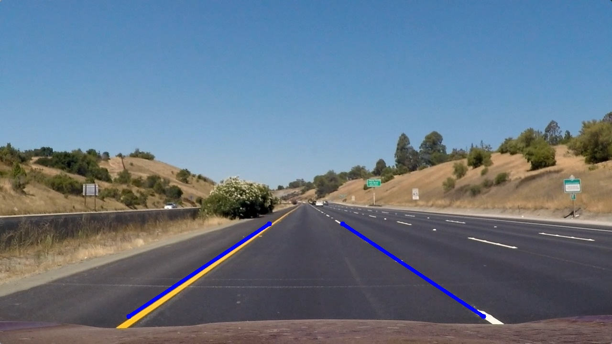
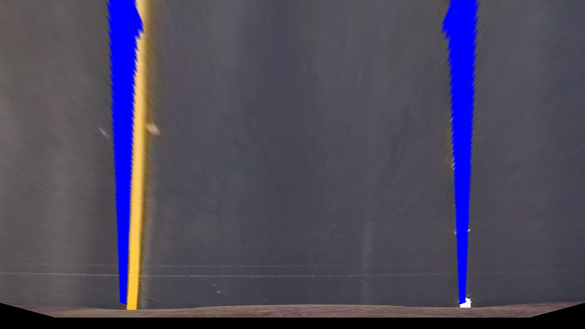
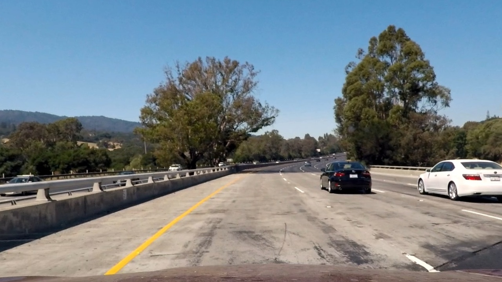
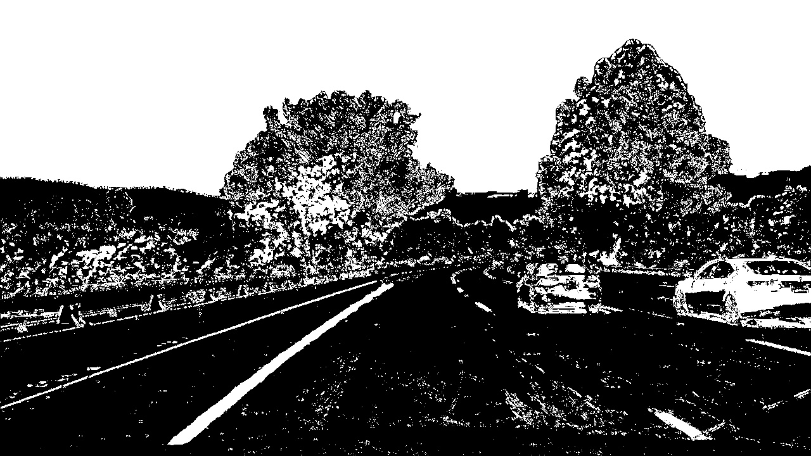
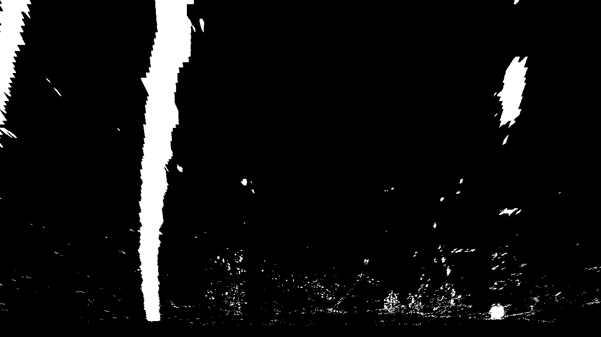
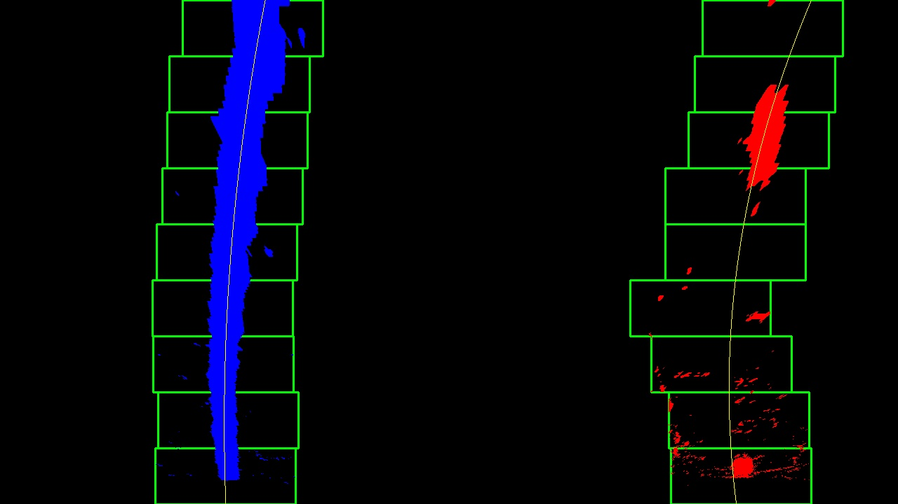
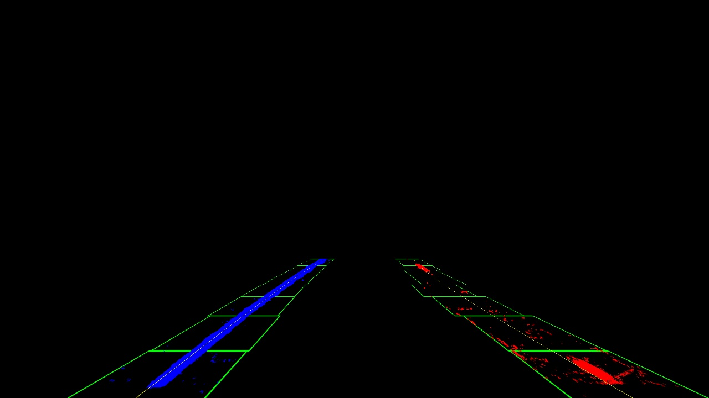
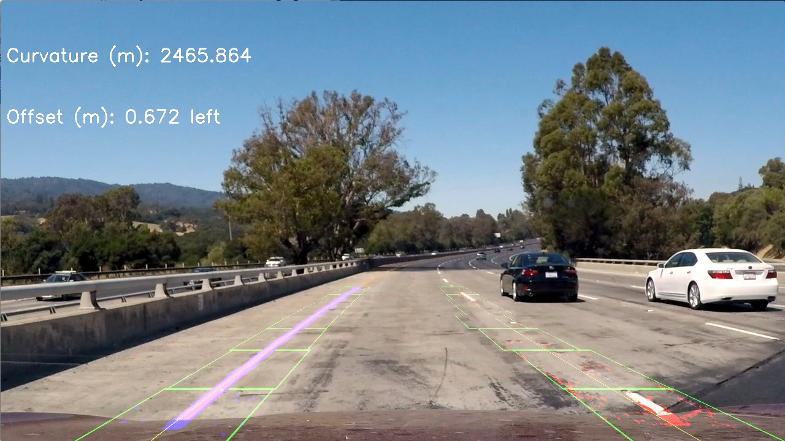

**Advanced Lane Finding Project**

The goals / steps of this project are the following:

* Compute the camera calibration matrix and distortion coefficients given a set of chessboard images.
* Apply a distortion correction to raw images.
* Use color transforms, gradients, etc., to create a thresholded binary image.
* Apply a perspective transform to rectify binary image ("birds-eye view").
* Detect lane pixels and fit to find the lane boundary.
* Determine the curvature of the lane and vehicle position with respect to center.
* Warp the detected lane boundaries back onto the original image.
* Output visual display of the lane boundaries and numerical estimation of lane curvature and vehicle position.

## [Rubric](https://review.udacity.com/#!/rubrics/571/view) Points

### Here I will consider the rubric points individually and describe how I addressed each point in my implementation.  

---

### Camera Calibration

The code for this step is contained in a script called [camera_calibration](camera_calibration.py).

A checkerboard makes for a good real world object for camera calibration as it has a very distinguishable pattern (for easy mapping of points from different angles) and a known shape (for mapping those points onto a 2D grid of known shape).  A set of checkerboard images was provided (with 6 rows and 9 columns of interior corners).  The cv2 findChessboardCorners() function takes in a grayscale image of a checkerboard, and potentially returns the positions of the corners in 2D space.  By iterating over a set of images (at different angles/perspectives), a collection of 3D points and their 2D counterparts can be fit into the cv2 calibrateCamera() function.  This function returns 2 coefficients (matrix and distortion saved in camera_calibration_pickle.p) which can be used later to undistort images for this camera.

The undistortion step is shown in the [test script](test.py) around lines 19-23.  The original distorted image is shown below with the undistorted image following.

  
  

### Perspective Calibration

The code for this step is contained in a script called [perspective_calibration](perspective_calibration.py).

For the perspective calibration, one of the straight line test images was used as a reference.  A trapezoid was drawn on top of the image such that the sides of the trapezoid roughly lined up with the edges of the lane.  This create a source set of 4 points for the transformation.  To get a plan view of the road, a set of corresponding rectangular (destination) points is needed that line up with the trapezoid points.  The set of source and destination points can be fed into the cv2 getPerspectiveTransform() function to get a matrix to transform from the perspective to plan view and vice versa (the inverse of the former).

To be honest, this was a lot of trial and error.  I imagine in the real world, you could use a technique similar to the camera calibration whereby you take an image with known dimensions to feed the destination points for the transform.  Nonetheless, after much trial and error, the calibration (saved as perspective_calibration_pickle.p) produces the following transform.

  
  

The lines are roughly straight and the same distance apart at the top and bottom of the image.  The transform is implemented as an image_processor (described in the next section) in [perspective_warper](/image_processors/perspective_warper.py).  The processor can either warp or un-warp depending on the matrix argument passed in on construction.   

### Pipeline (single images)

The pipeline is implemented as a set of image processor classes which can be found in the [image_processors](image_processors) folder.  Each image processor implements the image_processor base class which has a single method called process_image.  Without any real template this time, I decided on a more object oriented approach as I was unsure how the various image processing techniques would interact with each other.  In the end it may have been easier to just leave each technique as its own function, but a more object oriented approach is more what I'm used to in my day job.

Having setup a class for each image processing technique, I call each of them on the test images from the test folder.  This is lines 27-86 in the [test script](test.py).  The output of this can be found in [test_debug_outputs](test_debug_outputs) folder.

The lane finding pipeline is implemented into two classes.
-   [lane_finder](/image_processors/lane_finder.py)
-   [lane_analyzer](/image_processors/lane_analyzer.py)

lane_finder combines the various imaging techniques to obtain an undistorted binary image with perspective transformation.  This image is then fed into lane_analyzer to find the lane, fit a polynomial through the lane cloud of points, and determine the lane curvature and vehicle lateral offset.  This data is passed back to the lane_finder class for overlaying the found lane along with the curvature and offset info.  A step by step walkthrough of going from the original image to an analyzed image is show below.

#### 1. Undistort the image.

Using the matrix and distortion coefficients from the camera calibration script, each frame is undistorted.

  
  

This is done at line 24 in the [lane_finder](/image_processors/lane_finder.py) class.

#### 2. Create a binary thresholded image for lane analysis.

Through a little bit of experimentation and using some of the exercises from the lesson(s), I ended up using the sobel operator in X and Y along with looking at the saturation channel of the image.  By looking for activated pixels from both the X AND Y sobel operators, OR activated by the saturation transform, an image with fairly obvious lane lanes tends to be found.

  
  

Lines 25-30 is where this takes place in the [lane_finder](/image_processors/lane_finder.py) class.

#### 3. Apply a perspective transform for plan view lane analysis.

Having created a binary image, the perspective transform is applied to get a plan view of the road to analyze the lane.  The warped image is shown below.

  

This warping is applied at line 31 in [lane_finder](/image_processors/lane_finder.py) class.

#### 4. Pass the warped binary image to the lane analyzer class.

To separate out the responsibility of analyzing the warped image vs. creating it, there is a separate [lane analyzer](/image_processors/lane_analyzer.py) class for isolating the lane and calculating the curvature and offset.  Each frame is passed from the lane_finder class to the lane_analyzer at line 33 in  the [lane_finder](/image_processors/lane_finder.py) class.

The lane_analyzer class initializes the analysis using the sliding rectangle technique (from the lessons) on the first frame that is passed in.  This is done in the method [find_lane_pixels](https://github.com/sdccurious/CarND-Advanced-Lane-Lines/blob/eab4f4e1f9eabf7c37ee9c874aa7133cf22b0d17/image_processors/lane_analyzer.py#L20).

  

Subsequent calls to the class take advantage of having a an initialized starting point and search around the previous frame's polynomial (also reusing the code from the lessons).  This is done in the [search_around_poly](https://github.com/sdccurious/CarND-Advanced-Lane-Lines/blob/eab4f4e1f9eabf7c37ee9c874aa7133cf22b0d17/image_processors/lane_analyzer.py#L123) method.  Since there are no rectangles in this approach, the newly fitted polynomial is drawn as a filled in shape as opposed to rectangles.  This will be shown in the video down below.

The lane_analyzer class has __calculate_curvature() and __calculate_offset() methods for analyzing the left and right polynomials that are fitted for each frame.  In the case of the curvature output, the left and right curvatures are averaged for each frame.  A rolling average of 12 frames is used to help smooth the output that is displayed on the video.

The curvature is calculated using the by converting the pixels to meters using a rough estimate based on the expected real life size of a lane.  The radius of curvature can be calculated using the method described [here](https://www.intmath.com/applications-differentiation/8-radius-curvature.php).  

#### 5. Unwarp the analyzed image.

The process_image function of the lane_analyzer class returns a warped image with the lane overlay along with the curvature and offset to display on the frame.  At this point the image is still in plan view and needs to be transformed back into the camera's perspective.  This is done at line 34 of the [lane_finder](/image_processors/lane_finder.py) class.  A different instance of the perspective_warper class is used that uses the inverse matrix of perspective transform.  A sample image before overlay is shown below.

  

#### 6. Overaly the analyzed image with the original and display the curvature and offset.

Having analyzed the image and warped it back into the camera perspective, it can be overlayed with the original image along with the a display of the curvature and offset.  All the above steps for a single frame culminates in the following image.

  

---

### Pipeline (video)

Here's a [link to my video result](./output_images/project_video_processed.mp4).  The rectangles are only drawn for the first frame.  The lane_analyzer class subsequently fills in the lane and boundaries of the polynomial once the class has been seeded with the initial polynomial.  A sample frame looks like the following.

  

---

### Discussion

#### 1. Briefly discuss any problems / issues you faced in your implementation of this project.  Where will your pipeline likely fail?  What could you do to make it more robust?

The main problem I had was the perspective transform.  While the transform I came up with seems to find a reasonable looking lane, I would like the curvature output to be more robust.  By that I mean it should not jump around as much.  Also the initial curve should be a 1km radius and the curvature I'm getting is always more (although roughly in the right order of magnitude).  The curvature does increase significantly with the road is straight so it's not complete junk, but it could be better.

Another area for improvement would be how the current implementation handles the light gray pavement.  The right side lane being fitted for that portion is poor compared to the left side.  Improving this would definitely help the curvature output be more stable.  More time could have been spent playing with the image processing thresholds and exploring perhaps more color spaces or sobel techniques.

Despite the above flaws, the video still tends to follow a reasonable lane at least visually.
